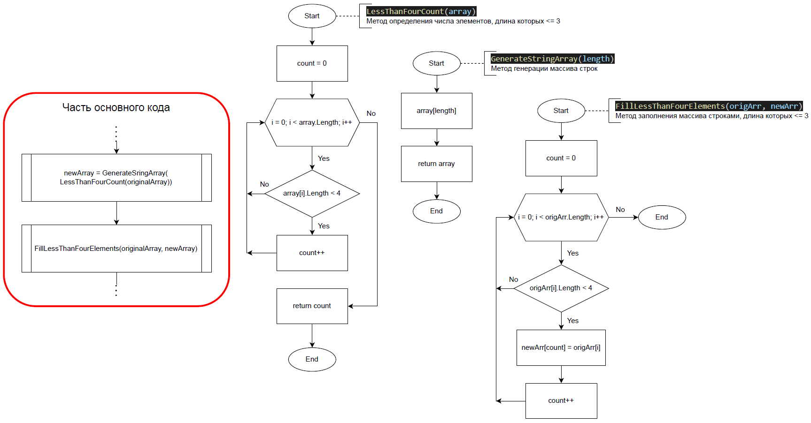

# Итоговая проверочная работа за первую четверть. Разработчик

Данная работа необходима для проверки ваших знаний и навыков по итогу прохождения первого блока обучения на программе разработчик. Мы должны убедиться что базовое знакомство с IT прошло успешно.

Задача алгоритмически не самая сложная, однако для поноценного выполнения проверочной работы необходимо:

1. Создать репозиторий на GitHub.
2. Нарисовать блок-схему алгоритма (можно обойтись блок-схемой основной содержательной части, если вы выделяете её в отдельный метод).
3. Снабдить репозиторий оформленным текстовым описанием решения (файл README.md).
4. Написать программу, решающую поставленную задачу.
5. Использовать контроль версий в работе над этим небольшим проектом (не должно быть так, что всё залито одним коммитом, как минимум этапы 2, 3 и 4 должны бить расположены в разных коммитах).

## Задача:

Написать программу, которая из имеющегося массива строк формирует массив из строк, длина которых меньше либо равна 3 символам. Первоначальный массив можно ввести с клавиатуры, либо задать на старте выполнения алгоритма. При решении не рекомендуется пользоваться коллекциями, лучше обойтись исключительно массивами.

## Нарисовать блок-схему алгоритма

Основная содержательная часть решения задачи разбита на три метода: 

1. Метод определения __размера__ нового массива. Для генерации нового массива, состоящего из определённых элементов имеющегося массива, следует определить, каким размером он будет.

    Для этого сначала необходимо установить счётчик со означением 0. Затем в цикле, переберая элементы имеющегося массива, находим строки, состоящие из трёх символов и меньше. При нахождении таких строк, увеличиваем значение счётчика на 1. После прохода по всем элементам массива возвращаем значение счётчика.

2. Метод __создания нового массива__ размером, который был определиён в предыдущем методе. Возвращает пустой массив строк.

3. Метод __заполнения нового массива__ элементами имеющегося массива, длина которых равна трём символам или меньше.

    В этом методе __сравниваем__ все элементы имеющегося массива через цикл __с искомыми__ и при совпадении присваиваем их значения элементам нового массива, созданного во втором методе. При присвоении следует учитывать, что индексы элементов имеющегося и нового массивов не будут совпадать. Для имеющегося массива используется инцекс цикла, а для нового массива — индекс, подбный счётчику из первого метода, но увеличвающийсля только __после__ присвоения элементу нового массива значения имеющегося массива.

В результае получаем следующую блок-схему:

## Написать программу, решающую поставленную задачу

В программе создание массива и его заполнение выведены в отдельные методы. Первоначальный массив вводится с клавиатуры через цикл. Его размер также задаётся пользователем с клавиатуры.

Полный код можно посмотреть в файле `\Code\Program.cs`